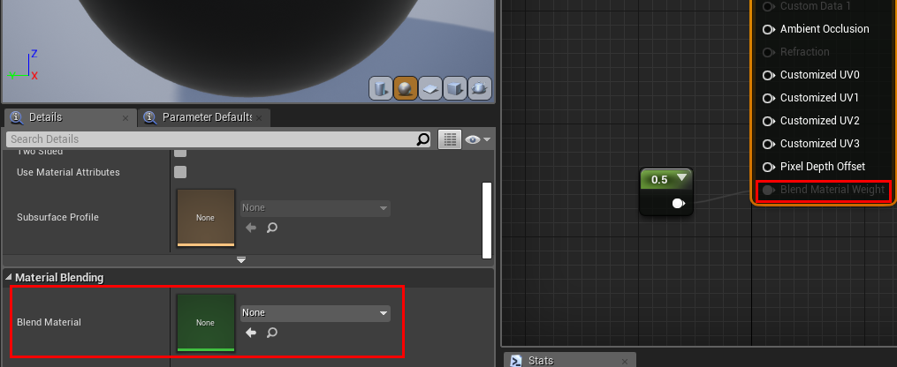
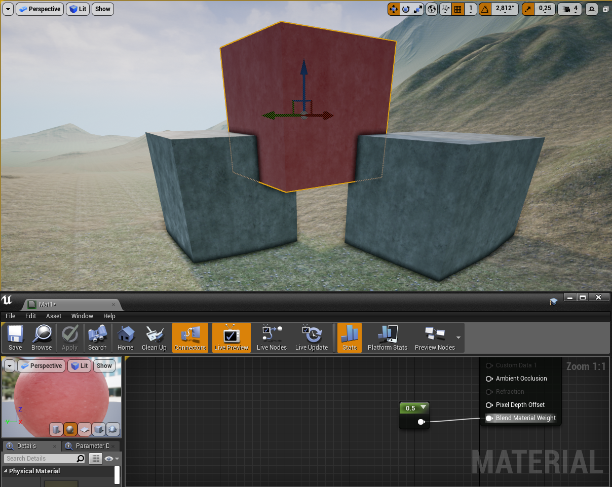
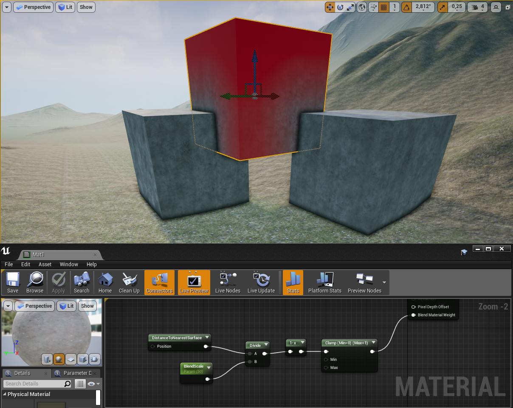
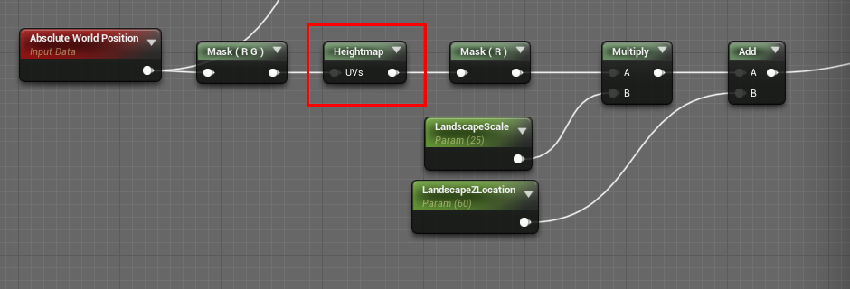
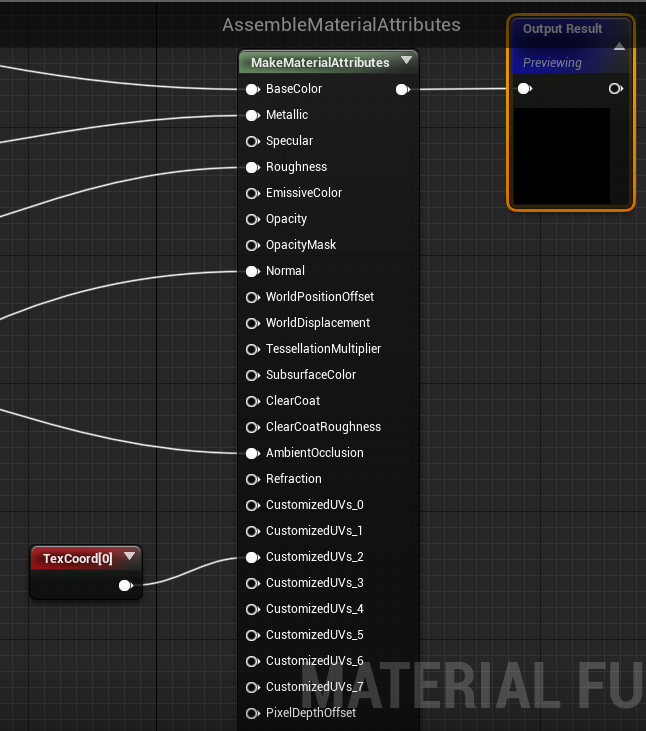
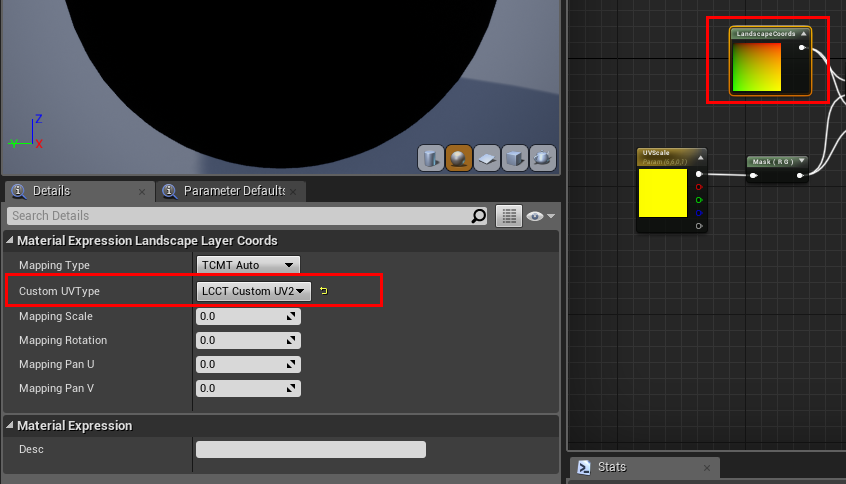
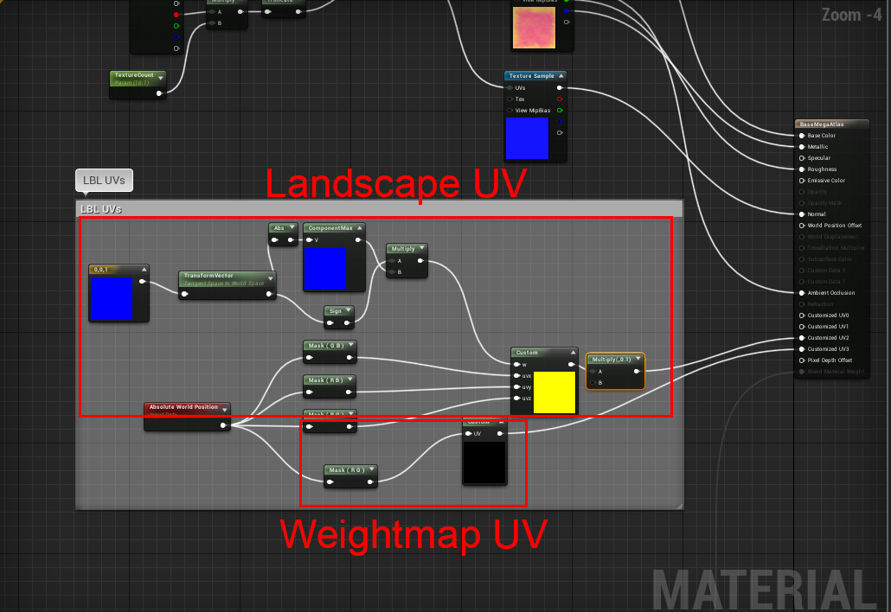

# UE4 Material Blending

This is auxiliary feature for UE4.21.2 that adds material and landscape blending to the engine. In order to use this feature you need to specify Blend Material and Blend Material Weight for a Material that should blend itself with another material. The idea is very simple - we linearly interpolate a number of material properties: Emissive Color, Base Color, Roughness, Metallic, Specular. We also blend normal property, but for achieving correct result we use next formula: Normal = (n1.xy + n2.xy * BlendMaterialWeight, n1.z); You can also override blend material property in material instance. Adding Material Blend feature will create new shader **with a complexity of both materials.**

  

   <i> Video demonstration </i>

   <i> Figure 1. New parameters and inputs in Material </i>

## Getting Started

Just download UnrealEngine-4.21.2 folder from repository and move/replace its contents to your engine folder. You will also have to recompile your engine afterwards. 

### Prerequisites

You have to run you project on UE4 4.21.2 compiled from sources. All prerequisites are the same as for running the usual engine. Merging with later versions of the engine was not tested, however may be possible. Please let us know about your experience in the comments. 

## Using new features

### Simple Material Blending

For blending two materials you need to setup few things. First of, you need to setup material that will be used for blending with desired material. To do this - you need set link to that material in Blend Material property (Figure 2). Number two, you need to specify blend weight based on some rules. In our example (Figure 2) we used constant of 0.5 for blending weight. It means that material inputs will be interpolated between those two materials with alpha 0.5.

    <i> Figure 2. Straightforward material blending using constant alpha 0.5</i>

Another example of setting Material blend weight is a use of Distance Fields (Figure 3). In this case we used DistanceToClosestSurface node with some additional computations to get materials blended in intersecting area.

    <i> Figure 3. Material blending based on Distance Fields technique </i>

### Heightmap node
This is auxiliary feature for landscape blending. This node requires absolute world position as input and returns packed z value in current point. In future releases functionality of all the network on below screenshot will be packed into Heightmap node. 

    <i> Figure 4. Example of using Heightmap node. LandscapeScale - scale along the Z axis of landscape actor. LandscapeZLocation - position along the Z axis of landscape actor </i>

### Landscape Matrerial Blending

Landscape material is a special case, it requires preprocessing to avoid material blending ‘conflicts’. First of all, we need to separate UVs to avoid conflict between materials. Materials usually use UV0 channel, Landscape uses 4 UVs (UV0-2 - for texturing, UV3 - for layers). In our example we redirected UV0 channel to UV2 and updated LandscapeCoord properties (Figure 5, 6).

    <i> Figure 5. Redirect UV0 to UV2</i>

    <i>Figure 6. Update Landscape Coord node</i>

After UV redirection we also need to recreate Landscape UV in base material.

    <i>Figure 7. Landscape UV and Weightmap UV</i>

To enable Landscape Blending you need to enable LandscapeBlending in primitive component.

For an in-depth look please refer to material examples supplied with the sample project:
**Material'/Game/LBL/Materials/BaseLandscape.BaseLandscape'** 
**Material'/Game/LBL/Materials/BaseSingle.BaseSingle'**

## Contributing

Please read [CONTRIBUTING.md](Documentation/CONTRIBUTING.md) for details on our code of conduct, and the process for submitting pull requests to us.

## Versioning

We use [SemVer](http://semver.org/) for versioning. For the versions available, see the [tags on this repository](https://github.com/fracturedbyte/UE4-MaterialBlending/tags). 

## Authors

* **Gleb Bulgakov** - *Initial coding* - [FracturedByte](https://github.com/BulgakovGleb)
* **Roman Leshchenko** - *Vision and workflow* - [FracturedByte](https://github.com/mazatracker)
* **Ruslan Smirnov** - *Example content* - [FracturedByte](https://github.com/fracturedbyte)

See also the list of [contributors](https://github.com/fracturedbyte/UE4-MaterialBlending/contributors) who participated in this project.

## Acknowledgments

* Many thanks for [PurpleBooth](https://gist.github.com/PurpleBooth/) for making templates of [CONTRIBUTION.md](https://gist.github.com/PurpleBooth/b24679402957c63ec426) and [README.md](https://gist.github.com/PurpleBooth/109311bb0361f32d87a2) that we've used for this repo
* Inspired by needs of UE4 developers

